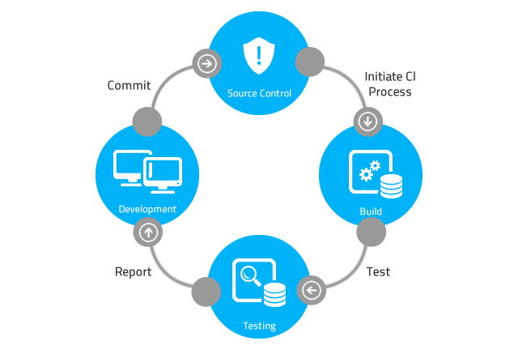
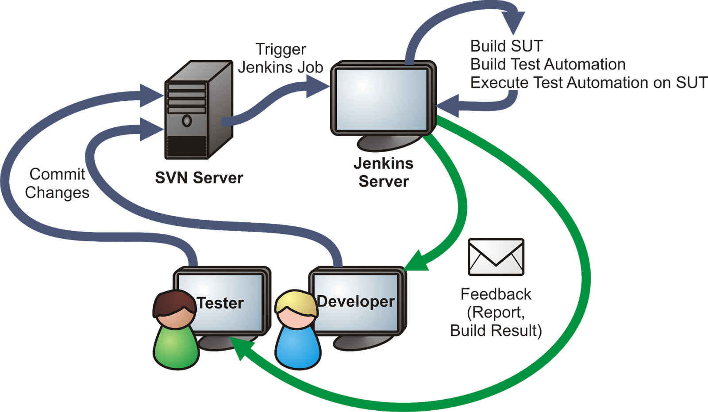
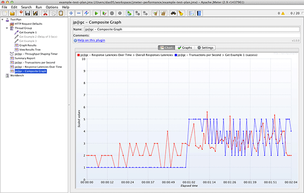
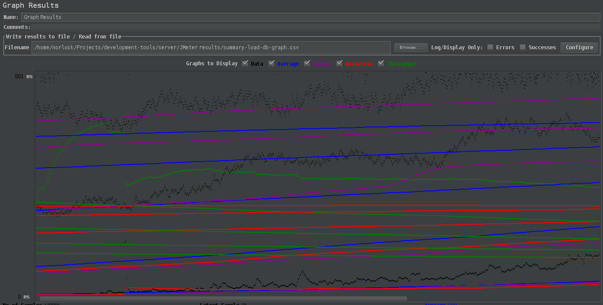

<!--<style>-->
	<!--#img-main-page {-->
		<!--display: block;-->
		<!--margin-left: auto;-->
		<!--margin-right: auto;-->
		<!--width: 40%;-->
	<!--}-->

	<!--#title {-->
		<!--color: #222;-->
		<!--display:block;-->
		<!--width: 100%;-->
		<!--text-align: center;-->
		<!--font-size: 36px;-->
	<!--}-->

	<!--#sub-title {-->
		<!--color: #333;-->
		<!--display:block;-->
		<!--width: 100%;-->
		<!--text-align: center;-->
		<!--font-size: 26px;-->
	<!--}-->

	<!--#error-report {-->
		<!--font-size: 100%;-->
		<!--font-weight: bold;-->
		<!--background: #525D76;-->
		<!--color: white;-->
		<!--text-decoration: none;-->
		<!--padding: 5px;-->
		<!--margin-right: 2px;-->
		<!--margin-left: 2px;-->
		<!--margin-bottom: 0;-->
	<!--}-->

	<!--.log {-->
		<!--margin-top: 0;-->
	<!--}-->

	<!--.el_method {-->
		<!--pointer-events: none;-->
	<!--}-->
<!--</style>-->

#Development Tools

<br>


<br><br><br><br>

**Gemaakt door:** Joris Willems<br>
**Studentnummer:** 349672<br>
**Datum:** 10-6-2018<br>

------

# Inhoudsopgave

1. [Build systemen](#build-systemen)
	1. [Gradle integratie](#gradle)
	2. [Verschillen tussen Java build systemen](#differences-systems)
	3. [npm](#npm)
	4. [Webpack](#webpack)
2. [Code analyse tools](#code-analyse-tools)
	1. [Checkstyle](#checkstyle)
	2. [FindBugs](#findbugs)
	3. [JaCoCo](#jacoco)
3. [Continuous integration](#ci)
	1. [Jenkins](#jenkins)
4. [DTAP](#dtap)
5. [JMeter](#jmeter)
	1. [Introductie](#introduction)
	2. [Onderzoek](#research)
	3. [Opzet test server](#server)
	4. [Opstartgids JMeter](#startup)
	5. [Performance tests](#performance)
	6. [Load tests](#load)
	7. [Stress tests](#stress)
	8. [Conclusie](#conclusion)
6. [Bronnen](#sources)
---

# 1. Build systemen <a name="build-systemen"></a>

Build systemen zijn tools die gebruikt worden voor een verscheidenheid van redenen, bijvoorbeeld management
dependencies, of eenvoudig kunnen builden, runnen en testen van projecten. De reden waarom build systemen zoals
Gradle/Maven worden gebruikt voor Java zal duidelijk worden door te kijken hoe projecten handmatig gebuild, gerund en beheerd
moeten worden. Een Java compiler kan vanaf de command line bestanden compileren en runnen. Om een bestand te
compileren moet het volgende commando vanaf de command line worden gebruikt:

```sh
javac MyFirstApplication.java
```

Op dit moment wordt het bestand gecompileerd naar een binary en krijgt het gecompileerde bestand een .class extensie. Op
dit moment bestaan er twee bestanden de .java bestand en het .class bestand. Het .java bestand wordt gebruikt voor ontwikkeling en het
.class bestand wordt gebruikt om het project te runnen. Om het project te runnen dient het volgende commando ingetypt te worden
vanaf de command line:

```sh
java MyFirstApplication.class
```

Voor ontwikkeling is het beter om de binaries en ontwikkelings bestanden te scheiden. De binaries zijn voor de
ontwikkeling uiteindelijk niet van belang. Daarvoor worden er door IDEs of build systemen vaak twee folders aangemaakt
bij het creëren van een nieuw project: out/build en src/app. Src (of app) wordt gebruikt voor de ontwikkeling, de out wordt gebruikt
voor de binaries. De volgende commando kan vanuit de command line worden uitgevoerd om de output naar een andere
directory te schrijven.

```sh
javac -d ../out/ MyFirstApplication.java 
```

Een project met deze complexiteit heeft op dit moment nog niet (duidelijk) zichtbaar voordeel van een build system zoals
Gradle, Ant of Maven. Op het moment dat externe bibliotheken moeten worden toegevoegd of er een testomgeving moet worden
ingericht beginnen build systemen noodzakelijk te worden. Om bijvoorbeeld handmatig externe bibliotheken toe te voegen
moet er eerst een directory aangemaakt worden die de .jar bestanden gaan bevatten. Er zijn bibliotheken die weer
afhankelijkheden hebben naar andere bibliotheken en ook weer afhankelijk zijn van een bepaalde versie van deze bibliotheek.
Om handmatig bij te houden welke versies voor welke libraries nodig zijn wordt snel onduidelijk en gevoelig voor
ontwikkelaarsfouten. Verder wil je als ontwikkelaar niet handmatig bijhouden of er nieuwere versies van deze bibliotheken
beschikbaar zijn om te updaten. Om een project met bibliotheken te compileren moet het classpath van deze bibliotheken
worden toegevoegd aan het commando.

```sh
javac -classpath ".:/home/path/mail.jar:/home/path/servlet.jar:" MyJavaFile.java
```

Build systemen helpen de ontwikkelaar met compileren en het bijhouden van externe bibliotheken en plugins. Elk project
heeft er baat bij om gebruik te maken van build systemen aangezien deze geen nadelig invloed hebben. Build systemen
regelen veel werk die anders handmatig moet worden uitgevoerd. Verder is er een complete centralisatie van beheer van
het project. Aanpassingen aan bibliotheken, taken of tests kunnen allemaal via dit punt geregeld worden. 

## 1.1 Gradle integratie <a name="gradle"></a>

Om te kijken hoe build systemen over het algemeen werken onderzoeken we als voorbeeld Gradle[2][3], een build systeem die
veelal wordt gebruikt in Java projecten en standaard is geintegreerd bij Android projecten. Gradle geeft een goed beeld
hoe build systemen werken en wat de mogelijkheden zijn. Om Gradle te integreren moet eerst Gradle geinstalleerd worden.
Wanneer Gradle is geinstalleerd kan er een Java project worden opgezet via het volgende shell commando:

```sh
gradle init --type java-application
```

Dit commando zal de volgende bestanden en folders aanmaken. 

```sh
.
|-- (1) build.gradle
|-- gradle
|   `-- wrapper
|       |-- (2) gradle-wrapper.jar
|       `-- (3) gradle-wrapper.properties
|-- (4) gradlew
|-- (5) gradlew.bat
|-- (6) settings.gradle
`-- src
|-- main
|   `-- java
|       `-- App.java
`-- test
`-- java
`-- AppTest.java
```

1. Project configuratie script om de taken, plugins, afhankelijkheden, etc, te configureren voor het project. 
2. Wrapper uitvoerbaar .jar bestand. De wrapper is een script die automatisch de juiste gradle versie installeert en
gebruikt. Voordeel hiervan is dat iedereen die aan dit project werkt dezelfde wrapper versie gebruikt, hierdoor
verminder je inconsistenties tussen ontwikkelaars.
3. Wrapper configuratie bestand voor Gradle.
4. Gradle wrapper script for Unix-based systemen.
5. Gradle wrapper script for windows.
6. Een configuratie bestand die aangeeft welke projecten mee moeten worden genomen in de build. 

In het build.gradle bestand zal de eerste regel aangeven om wat voor type project het dient te gaan. Om aan te geven dat
het een Java project betreft gebruiken we de Java plugin:

```gradle
apply plugin: 'java' 
```

Op dit moment kan het project gebuild worden, door een van de volgende commando's: 

```sh
gradle build
```
Het project zal gebouwd worden d.m.v. de Gradle versie die geinstalleerd is op de machine. Om het project te builden via
de wrapper op een UNIX machine moet de volgende commando worden gebruikt:

```sh 
./gradlew build 
```

Het project zal gebouwd worden d.m.v. de Gradle versie die staat aangegeven in het wrapper configuratie bestand. Wanneer
deze nog niet lokaal geinstalleerd is, zal deze gedownload en geinstalleerd worden. Een aantal tasks die belangrijk voor
de code kwaliteit zijn: 
* gradle check: start taken van tools die de code analyseren zoals Checkstyle en PMD.
* gradle test: start taken van tools die de code testen zoals JUnit of andere test frameworks.

JUnit zal in Gradle een HTML bestand genereren die aangeeft hoeveel tests succesvol zijn, hoeveel gefaald zijn en welke
zijn genegeerd. Een ontwikkelaar kan door de bestanden klikken die gefaald zijn en krijgt daarbij de feedback te zien
van deze tests.

Met Gradle kunnen er makkelijk taken worden gemaakt, in hoofdstuk [2.3](#jacoco) zal een voorbeeld van een Gradle taak
te zien zijn. 

## 1.2 Verschillen tussen Java build systemen <a name="differences-systems"></a>

Er zijn veel verschillende soorten build systemen, build systemen zijn toegespitst op specifieke programeertalen. Gradle
kan bijvoorbeeld overweg met Java, C++ en Kotlin, maar Maven werkt niet met C++ projecten. De web applicaties maken vaak
gebruik van build systemen zoals npm of Yarn. npm wordt verder toegelicht in het volgende hoofdstuk. Build systemen voor
Java zijn verschillend en hebben verschillende voordelen en nadelen. Er zijn een aantal build systemen die
voornamelijk worden gebruikt voor Java[3]: 
* Ant
* Maven 
* Buildr
* Gradle

Ant is een wat verouderde build systeem en wordt niet veel meer gebruikt. Ant dependency management gebeurd via Ivy, een
aparte tool die je toevoegd aan het Ant project. 

Maven is de opvolger van Ant en ontwikkeld door Apache. Maven werkt met XML configuratie bestanden en heeft net als
Gradle dependency management.  

Gradle is speciaal ontwikkeld om goed met meerdere projecten te kunnen werken. De syntax van Gradle is compacter dan van
Maven. Hieronder een voorbeeld van een Maven configuratie bestand (pom.xml):

```maven 
<project xmlns="http://maven.apache.org/POM/4.0.0" xmlns:xsi="http://www.w3.org/2001/XMLSchema-instance" xsi:schemaLocation="http://maven.apache.org/POM/4.0.0 http://maven.apache.org/maven-v4_0_0.xsd">
<modelVersion>4.0.0</modelVersion>
<groupId>com.programming.mitra</groupId>
<artifactId>java-build-tools</artifactId>
<packaging>jar</packaging>
<version>1.0</version>
<dependencies>
<dependency>
<groupId>junit</groupId>
<artifactId>junit</artifactId>
<version>4.11</version>
</dependency>
</dependencies>
<build>
<plugins>
<plugin>
<groupId>org.apache.maven.plugins</groupId>
<artifactId>maven-checkstyle-plugin</artifactId>
<version>2.12.1</version>
<executions>
<execution>
<configuration>
<configLocation>config/checkstyle/checkstyle.xml</configLocation>
<consoleOutput>true</consoleOutput>
<failsOnError>true</failsOnError>
</configuration>
<goals>
<goal>check</goal>
</goals>
</execution>
</executions>
</plugin>
<plugin>
<groupId>org.codehaus.mojo</groupId>
<artifactId>findbugs-maven-plugin</artifactId>
<version>2.5.4</version>
<executions>
<execution>
<goals>
<goal>check</goal>
</goals>
</execution>
</executions>
</plugin>
<plugin>
<groupId>org.apache.maven.plugins</groupId>
<artifactId>maven-pmd-plugin</artifactId>
<version>3.1</version>
<executions>
<execution>
<goals>
<goal>check</goal>
</goals>
</execution>
</executions>
</plugin>
</plugins>
</build>
</project>
```

Hierboven zijn een aantal plugins toegevoegd:
* Checkstyle
* Findbugs
* PMD

Maven configuratie bestanden groeien snel, met het nieuwere Gradle kan een vergelijkbaar bestand als volgt worden
opgezet:

```gradle
apply plugin:'java'
apply plugin:'checkstyle'
apply plugin:'findbugs'
apply plugin:'pmd'

version ='1.0'

repositories {
	mavenCentral()
}

dependencies {
	testCompile group:'junit', name:'junit', version:'4.11'
}
```

In het dependencies blok worden de afhankelijkheden aangegeven. Testcompile geeft aan dat deze bibliotheek alleen wordt
gecompileerd mits het gaat om een test build. Het blok repositories geeft aan waar deze bibliotheken van gedownload 
kan worden. Deze bibliotheken worden gedownload van de maven central repository (https://search.maven.org). Een andere
bekende repository die veel gebruikt word is jcenter (https://bintray.com/bintray/jcenter).  

Gradle presteert over het algemeen beter qua snelheid, dit heeft ook temaken met incrementele builds waar Gradle
gebruik van maakt. Dit houdt in dat builds gecached worden en over tijd sneller gecompileerd worden, dit is niet het
geval is bij Maven.

Verschillende ontwikkelaars die Maven gebruiken (of gebruikte) klagen over complexiteit van het POM.xml(configuratie) bestand naarmate
het project groeit.

(bron: https://stackoverflow.com/questions/1306579/buildr-gradle-or-wait-for-maven-3)

## 1.3 npm <a name="npm"></a>

npm (**N**ode **P**ackage **M**anager) is een package manager[10]. npm is net zoals Gradle een command line tool.
Bibliotheken kunnen worden toegevoegd, verwijderd en worden opgewaardeerd. npm kan met het volgende commando aan het
project toegevoegd worden:

```sh
npm init
```

Npm zal een bij het initialiseren een aantal standaard vragen stellen m.b.t. de auteur, git repository, kern woorden,
etc. Wanneer deze vragen zijn beantwoord wordt er een package.json bestand aangemaakt. Dit bestand fungeert ongeveer
hetzelfde als de build.gradle voor Gradle. Hieronder een voorbeeld van een relatief eenvoudig package.json bestand:

```json
{
	"name": "webpack-demo",
	"version": "1.0.0",
	"description": "",
	"private": true,
	"scripts": {
		"test": "echo \"Error: no test specified\" && exit 1"
	},
	"keywords": [],
	"author": "",
	"license": "ISC",
	"devDependencies": {
		"webpack": "^4.12.0",
		"webpack-cli": "^3.0.8"
	},
	"dependencies": {
		"lodash": "^4.17.10"
	}
}
```

npm heeft de mogelijkheid om de scope van een pakket te bepalen, zo kunnen bijvoorbeeld de
volgende vlaggen worden meegegeven bij het installeren van een pakket: 
* npm install --save-dev webpack (installeert het pakket als een development dependency en wordt niet meegenomen in een build)
* npm install --global webpack (installeert het pakket globaal op de machine en zal dus niet binnen het project opgeslagen
		worden)
* npm install --save webpack (installeert het pakket en voegt deze dependency toe aan het package.json bestand)
* npm install webpack (installeert het pakket tijdelijk maar zal bij een volgende install niet meer worden meegenomen)

Bedrijven die zich met web applicaties bezig houden maken vaak gebruik van gedeelde (interne)bibliotheken. Vaak worden
deze bibliotheken als private npm packages gedistribueerd. Dit heeft als voordeel dat projecten die deze bibliotheken
gebruiken makkelijk via npm een specifieke versie van deze bibliotheek kunnen gebruiken. Oudere projecten gebruiken vaak
oudere versies van bibliotheken om breakages te voorkomen.

npm heeft de mogelijkheid om scripts te definieeren, dit kunnen unit tests zijn maar ook zelf gedefinieerde scripts. npm
start is de standaard script functie om het project te starten. `npm start` zal in dit geval een alias zijn voor `node
server.js`. Een eigen toegevoegde script zoals browser kan gestart worden door het commando: `npm run browser`.

Alle paketten kunnen aan de hand van package.json:
* Geinstalleerd worden door het commando: npm install.
* Opgewaardeerd worden door het commando: npm update.

Bij een van deze commando's zal er een folder "node_modules" in dezelfde folder als de package.json worden aangemaakt,
deze folder bevat alle geinstalleerde pakketten uitgezonderd van globale pakketten.

## 1.4 Webpack <a name="webpack"></a>

Webpack is een tool om JavaScript bestanden te kunnen bundelen[4]. Bundelen wil zeggen dat de JavaScript code van het
project zo compact mogelijk wordt samengevoegd. Het bundelen van JavaScript bestanden heeft
meerdere voordelen:
* Prestaties verbeteren.
* Minify (Ruimte besparen).
* Uglify (code slechter leesbaar maken voor de buitenwereld).

Webpack kan via npm geinstalleerd worden als een development dependency, Webpack kan gebruikt worden d.m.v. NPX (Node
package runner). NPX is een tool van npm om binaries te kunnen runnen. Om webpack te start moet het volgende commando
uitgevoerd worden `npx webpack`. Deze zal de source code bundelen en een bestand main.js genereren in de
dist(distribution) folder. 

Voor complexere projecten is het handig om gebruik te maken van een configuratie bestand om meer aanpassingen te kunnen
maken en deze niet steeds als parameters te hoeven opgeven op de command line. Webpack maakt gebruik van een
webpack.config.js bestand.

```javascript
const path = require('path');

module.exports = {
entry: './src/index.js',
   output: {
filename: 'main.js',
	  path: path.resolve(__dirname, 'dist')
   }
};
```

De entry is het JavaScript bestand die gebruikt wordt om de applicatie te starten. Het output blok gaat over de
configuratie van de bundle, (welke locatie dient dit bestand naartoe geschreven te worden, hoe moet dit bestand
		genoemd worden, etc.). Het commando 'npx webpack' zal dit bestand automatisch herkennen. In de development wereld worden
deze commando's vaak als npm scripts toegevoegd in de package.json om de commando's voor andere ontwikkelaars zo
duidelijk mogelijk te maken.

(bron: https://webpack.js.org/guides/output-management/)

```gradle
...
"scripts": {
	"test": "echo \"Error: no test specified\" && exit 1",
		"build": "webpack"
},
...
```

Op dit moment zal het commando: 'npm run build' gelijk zijn aan npx webpack. Voordeel hiervan is dat ontwikkelaars
gelijk in de package.json kunnen zien hoe ze een project kunnen builden. Als een ontwikkelaar nooit eerdere met webpack
heeft gewerkt zal hij/zij niet direct kunnen afleiden dat het `npx webpack` commando zal moeten worden uitgevoerd om een
nieuwe build te genereren. In het scripts blok hoeft npx niet ervoor te staan, dat zal npm automatisch herkennen. 

# 2. Code analyse tools  <a name="code-analyse-tools"></a>

Er zijn verschillende tools beschikbaar om de code kwaliteit te kunnen analyseren. Drie tools worden verder in dit hoofdstuk toegelicht:
* **Checkstyle:** een tool die wordt gebruikt om te kunnen vaststellen of bepaalde code conventies worden nageleeft.
* **FindBugs:** herkennen van veel voorkomende bugs in code, probeert ook bugs te herkennen die niet door de compiler worden
afgevangen
* **JaCoCo:** het berekenen van hoeveel (procent) van de code wordt afgedekt door unit tests.

## 2.1 Checkstyle <a name="checkstyle"></a>

Checkstyle is een plugin die gebruikt wordt om de code consistentie/kwaliteit te verbeteren[5]. Checkstyle kijkt of de code
conventies worden nageleeft. Er zijn verschillende code conventies mogelijk, sommige development teams prefereren om de
accolade ({) op de bovenste regel te hanteren i.p.v. op de volgende regel. Deze regels
worden vastgelegd binnen een xml bestand. 

```xml
<module name="LineLength">
<property name="max" value="100"/>
<property name="ignorePattern" value="^package.*|^import.*|a href|href|http://|https://|ftp://"/>
</module>
```

Hierboven een afspraak voor bijvoorbeeld lengte van een regel. Er mogen maximaal 100 karakters op een regel staan, tenzij het een
package, import of link betreft. Er zijn verschillende speciale karakters hierboven te zien, deze karakters hebben een
bepaalde betekenis:
* | : of mogelijkheden (of package of import of ...)
* \* : kan alle karakters of nummers bevatten (import org.junit...)

Er zijn een aantal Checkstyle configuratie bestanden die veel gebruikt worden door developers, denk hierbij aan de Checkstyle
rules van Google of Sun. Checkstyle kan door Gradle worden toegevoegd als plugin. Om Checkstyle te runnen via de
command line moet het volgende commando worden gebruikt:

```sh
gradle check
```

Door het uitvoeren van dit commando zal een HTML bestand worden gegenereerd binnen de build/reports folder. Dit HTML
bestand zal weergeven waar de regels zijn over treden. Voorbeeld van foutmeldingen van een Checkstyle run die Sun
rules gebruikt:

<h3 id="error-report">File /home/norlock/Projects/developmentTools/MyFirstApplication/src/main/java/MyFirstApplication.java</h3>
<table class="log" width="100%" cellspacing="2" cellpadding="5" border="0">
<tbody><tr>
<th>Error Description</th><th>Line</th>
</tr>
<tr class="a">
<td>Missing package-info.java file.</td><td>0</td>
</tr>
<tr class="b">
<td>Missing a Javadoc comment.</td><td>1</td>
</tr>
<tr class="a">
<td>Utility classes should not have a public or default constructor.</td><td>1</td>
</tr>
<tr class="b">
<td>Missing a Javadoc comment.</td><td>3</td>
</tr>
<tr class="a">
<td>Parameter args should be final.</td><td>3</td>
</tr>
<tr class="b">
<td>File contains tab characters (this is the first instance).</td><td>4</td>
</tr>
<tr class="a">
<td>Line is longer than 80 characters (found 98).</td><td>12</td>
</tr>
<tr class="b">
<td>First sentence should end with a period.</td><td>15</td>
</tr>
<tr class="a">
<td>Line is longer than 80 characters (found 90).</td><td>16</td>
</tr>
<tr class="b">
<td>Line is longer than 80 characters (found 89).</td><td>21</td>
</tr>
<tr class="a">
<td>Parameter argument1 should be final.</td><td>21</td>
</tr>
<tr class="b">
<td>Parameter argument2 should be final.</td><td>21</td>
</tr>
<tr class="a">
<td>Line is longer than 80 characters (found 85).</td><td>26</td>
</tr>
<tr class="b">
<td>Parameter argument should be final.</td><td>31</td>
</tr>
</tbody></table>

Hierin wordt het bijvoorbeel duidelijk dat er variabelen zijn die niet final zijn, maar dat de afspraak is dat deze dat wel zijn.

Vaak hebben IDEs specifieke Checkstyle plugins, voor bijvoorbeeld Intellij IDEA of Eclipse. Checkstyle is
afhankelijk van een checkrun. Wanneer deze is gedraaid zal de plugin de bestanden aangeven met fouten. Deze fouten
kunnen bijvoorbeeld zijn dat er gebruik wordt gemaakt van tabs i.p.v. spaties, of dat de indentatie verkeerd is. Bij
de IDEA plugin ziet een foutmelding er als volgt uit en wordt deze in een dialoog venster weergegeven i.p.v. een HTML
bestand:

```
Line contains a tab character. (15:1) [FileTabCharacterCheck]
```

Development teams kunnen verschillende eisen stellen over hoe streng ze willen dat Checkstyle is. Checkstyle kan er
standaard voor zorgen de het project wel of niet gebuild kan worden als checkstyle fouten heeft gedetecteerd  

## 2.2 FindBugs <a name="findbugs"></a>

FindBugs is een tool die gebruikt wordt om veel voorkomende bugs te herkennen[6]. Findbugs support geen Java versies boven
1.8 in tegenstelling tot SpotBugs en moet de spirituele opvolger van FindBugs worden. Aangezien SpotBugs nog in
ontwikkeling is wordt Findbugs onderzocht. FindBugs kan via Gradle of IDEs zoals Intellij IDEA worden geintegreerd als
plugin. FindBugs is afhankelijk van gecompileerde code dus zal altijd pas werken nadat Gradle het project gebuild heeft.

Via Gradle kan FindBugs net als Checkstyle worden gestart door het volgende commando:

```sh
gradle check
```

In de code kan bijvoorbeeld de volgende Bug zijn geschreven die niet door de compiler of IDE wordt herkend:

```java
private static String notTrimmed = " This string won't be trimmed ";

public static void congratulateUser() {
	notTrimmed.trim();
	...	
}
```

Op dit moment zal de code werken omdat de ontwikkelaar geen _foute_ code heeft geschreven. FindBugs herkent dit wel als
een bug, de gebruiker roept de methode trim() aan die een getrimde string teruggeeft, maar deze waarde vervolgens niet
gebruikt. FindBugs geeft de details van de bug weer zoals in het voorbeeld hieronder te zien is.

>The return value of this method should be checked. One common cause of this warning is to invoke a method on an immutable object, thinking that it updates the object. For example, in the following code fragment,
>```
	>	String dateString = getHeaderField(name);
>	dateString.trim();
>```
>the programmer seems to be thinking that the trim() method will update the String referenced by dateString. But since Strings are immutable, the trim() function returns a new String value, which is being ignored here. The code should be corrected to:
>```
>   String dateString = getHeaderField(name);
>   dateString = dateString.trim();
>```

FindBugs heeft verschillende niveaus gradaties van code controlleren, zo kan er streng of meer vrij gecontroleerd worden op bugs. Ook is er een optie om de Gradle wel of niet te laten compileren mochten er fouten zijn gedetecteerd door FindBugs. 

## 2.3 JaCoCo <a name="jacoco"></a>

JaCoCo is een tool die gebruikt wordt om te bepalen hoeveel procent van de code is afgedekt door unit tests. JaCoCo kan
toegevoegd worden aan gradle:

```gradle 
apply plugin: "jacoco"
```

JaCoCo is afhankelijk van `gradle test` om een report te kunnen schrijven. Het is met JaCoCo net als bij FindBugs en
Checkstyle mogelijk om een eenvoudige HTML pagina te genereren om de resultaten te visualiseren, door de volgende taak
toe te voegen aan het build.gradle bestand:

```
jacocoTestReport {
	reports {
		xml.enabled false
			csv.enabled false
			html.destination file("$buildDir/reports/jacoco/main")
	}
}
```

Nadat `gradle test` is uitgevoerd kan er een test rapport gemaakt worden door JaCoCo. JaCoCo berekend hoeveel procent
van de code is afgedekt door unit tests. Vervolgens kan er door classes geklikt om te kijken naar de coverage per class.
Hieronder is een voorbeeld te zien van het resultaat van JaCoCo.

<table class="coverage" id="coveragetable" cellspacing="0"><thead><tr><td class="sortable" id="a"
onclick="toggleSort(this)">Element</td><td class="down sortable bar" id="b" onclick="toggleSort(this)">Missed
Instructions</td><td class="sortable ctr2" id="c" onclick="toggleSort(this)">Cov.</td><td class="sortable bar" id="d"
onclick="toggleSort(this)">Missed Branches</td><td class="sortable ctr2" id="e" onclick="toggleSort(this)">Cov.</td><td
class="sortable ctr1" id="f" onclick="toggleSort(this)">Missed</td><td class="sortable ctr2" id="g"
onclick="toggleSort(this)">Cxty</td><td class="sortable ctr1" id="h" onclick="toggleSort(this)">Missed</td><td
class="sortable ctr2" id="i" onclick="toggleSort(this)">Lines</td><td class="sortable ctr1" id="j"
onclick="toggleSort(this)">Missed</td><td class="sortable ctr2" id="k"
onclick="toggleSort(this)">Methods</td></tr></thead><tfoot><tr><td>Total</td><td class="bar">17 of 24</td><td
class="ctr2">29%</td><td class="bar">0 of 0</td><td class="ctr2">n/a</td><td class="ctr1">4</td><td
class="ctr2">6</td><td class="ctr1">8</td><td class="ctr2">10</td><td class="ctr1">4</td><td
class="ctr2">6</td></tr></tfoot><tbody><tr><td id="a0"><a href="#"
class="el_method">congratulateUser()</a></td><td class="bar" id="b0"></td><td class="ctr2" id="c2">0%</td><td class="bar" id="d0"></td><td class="ctr2"
id="e0">n/a</td><td class="ctr1" id="f0">1</td><td class="ctr2" id="g0">1</td><td class="ctr1" id="h0">3</td><td
class="ctr2" id="i0">3</td><td class="ctr1" id="j0">1</td><td class="ctr2" id="k0">1</td></tr><tr><td id="a1"><a
href="#" class="el_method">main(String[])</a></td><td class="bar" id="b1"></td><td class="ctr2" id="c3">0%</td><td
class="bar" id="d1"></td><td class="ctr2" id="e1">n/a</td><td class="ctr1" id="f1">1</td><td class="ctr2"
id="g1">1</td><td class="ctr1" id="h1">3</td><td class="ctr2" id="i1">3</td><td class="ctr1" id="j1">1</td><td
class="ctr2" id="k1">1</td></tr><tr><td id="a2"><a href="#"
class="el_method">MyFirstApplication()</a></td><td class="bar" id="b2"></td><td class="ctr2" id="c4">0%</td><td class="bar" id="d2"></td><td
class="ctr2" id="e2">n/a</td><td class="ctr1" id="f2">1</td><td class="ctr2" id="g2">1</td><td class="ctr1"
id="h2">1</td><td class="ctr2" id="i2">1</td><td class="ctr1" id="j2">1</td><td class="ctr2" id="k2">1</td></tr><tr><td
id="a5"><a href="#" class="el_method">unusedMethodWithArguments(int, double)</a></td><td
class="bar" id="b3"></td><td
class="ctr2" id="c5">0%</td><td class="bar" id="d3"></td><td class="ctr2" id="e3">n/a</td><td class="ctr1"
id="f3">1</td><td class="ctr2" id="g3">1</td><td class="ctr1" id="h3">1</td><td class="ctr2" id="i3">1</td><td
class="ctr1" id="j3">1</td><td class="ctr2" id="k3">1</td></tr><tr><td id="a3"><a
href="#" class="el_method">someDifficultCalculation(int)</a></td><td class="bar"
id="b4"></td><td class="ctr2"
id="c0">100%</td><td class="bar" id="d4"></td><td class="ctr2" id="e4">n/a</td><td class="ctr1" id="f4">0</td><td
class="ctr2" id="g4">1</td><td class="ctr1" id="h4">0</td><td class="ctr2" id="i4">1</td><td class="ctr1"
id="j4">0</td><td class="ctr2" id="k4">1</td></tr><tr><td id="a4"><a href="#"
class="el_method">static {...}</a></td><td class="bar" id="b5"></td><td class="ctr2" id="c1">100%</td><td class="bar" id="d5"></td><td class="ctr2"
id="e5">n/a</td><td class="ctr1" id="f5">0</td><td class="ctr2" id="g5">1</td><td class="ctr1" id="h5">0</td><td
class="ctr2" id="i5">1</td><td class="ctr1" id="j5">0</td><td class="ctr2" id="k5">1</td></tr></tbody></table>

Uit dit voorbeeld wordt duidelijk dat er verschillende instructies worden gemist. Een instructie kan bijvoorbeeld zijn:
`int i = 0;`, Uiteindelijk zijn 17 van de 24 instructies niet getest. In het testrapport is het ook mogelijk om te
kijken welke instructies gemist worden door op een methode hierboven te klikken zoals `congratulateUser();`, die in
dit voorbeeld hierboven zijn uitgeschakeld. Dit zou het klasse bestand openen en met rood/groene kleuren markeren welke
instructies wel of niet getest worden.

Deze tools zijn belangrijk omdat het schrijven van goede tests belangrijk zijn voor de code kwaliteit. Uiteindelijk
willen de developers een houvast hebben om te bepalen of hun unit tests aan een bepaalde kwaliteit voldoen. Via Gradle
kunnen deze taken worden aangepast naar eigen voorkeuren. Zo kunnen er ook XML of CSV bestanden gegenereerd worden die
met eigen tools kunnen worden geanalyseerd. 

# 3. Continuous Integration <a name="ci"></a>

Continuous integration of CI, is een ontwikkelingsproces waarbij ontwikkelaars vaak code integreren naar een gedeelde
repository. Elke integratie zal door een automatische wasstraat van development tools en tests gaan[8]. Dit zorgt ervoor
dat code aan een bepaalde minimum norm moet voldoen om geaccepteerd te worden. Zo kan bijvoorbeeld een vereiste zijn dat
code dat niet gebuild kan worden automatisch niet wordt geaccepteerd door de master en development branch. 



De stappen worden volgens een chronologisch patroon doorlopen, het is bijvoorbeeld niet van belang om uitgebreide tests
uit te voeren als de code al niet gecompileerd kan worden. Er zijn tools die helpen om dit process automatisch te
hanteren. In dit hoofdstuk zal Jenkins als continuous integration tool verder worden onderzocht.

## 3.1 Jenkins <a name="jenkins"></a>
Jenkins is een continuous integration tool dat op een server draait en afhankelijk is van een versiebeheer systeem zoals
Git of SVN [7]. Jenkins kan gedownload worden als een war bestand een binary voor Java, of als een prepackaged
binary (voor bijvoorbeeld Ubuntu). Vervolgens kan deze war via de java-cli gestart worden met commando: `java -jar
jenkins.war --httpPort=8090`. De keuze voor de HTTP port is aan de ontwikkelaar zelf. 

De ontwikkelaar kan naar `http://localhost:8090` browsen om de setup wizard van Jenkins te doorlopen. Wanneer de
installatie is voltooid zal de gebruiker doorverwezen worden naar een portaal. Binnen dit portaal kunnen alle
instellingen voor jenkins geconfigureerd worden. 



Het concept van tools en taken die automatisch doorlopen worden, wordt ook wel een _continuous delivery pipeline_
genoemd. Deze pipeline wordt gedefinieerd door een configuratie bestand(Jenkinsfile). Via een plugin is het ook mogelijk
om Jenkins direct met Gradle te verbinden, Jenkins zal opzoek gaan naar de gradle wrapper en deze vervolgens
gebruiken om commando's uit te voeren zoals bijvoorbeeld /gradlew build --scan.

Resultaten worden via de e-mail verstuurd, toegevoegd als Slack bots, of kunnen opgezocht worden via het portaal. Reden
dat e-mails vaak gebruikt worden is dat niet elke build per se gecontroleerd hoeft te worden tenzij er crashes
plaatsvinden. Via e-mails kunnen developers snel geinformeerd worden en kunnen deze ook buiten
kantoortijden snel gealarmeerd worden wanneer er problemen plaatsvinden.

De kracht van Jenkins is de eenvoud in het toevoegen van plugins, zo kunnen tools als FindBugs en Checkstyle makkelijk
toegevoegd worden. Zo kan met bijvoorbeeld een android plugin een simulator worden opgestart bij elke nieuwe build. 

## 3.2 Server omgeving <a name="server-environment"></a>

Jenkins draait op een server, om Jenkins in te kunnen stellen moeten ontwikkelaars hier makkelijk bij kunnen. Developers
maken hierdoor vaak gebruik van SSH (**S**ecure **SH**ell), een tool die zowel UNIX systemen als op Windows systemen kan
draaien. SSH is gemaakt zodat een systeem van afstand bestuurbaar is. Deze tool maakt gebruik van cryptografie om ervoor
te zorgen dat er geen gevoelige informatie gelekt kan worden warneer deze via het internet vervoert wordt. De standaard
poort voor SSH is 22, maar kan veranderd worden. Automatisch is deze poort geblokkeerd om ongewenste bezoekers tegen
te gaan.

Een andere programma dat vaak gebruikt wordt in combinatie met Jenkins is Docker. Docker is een programma dat op
besturings niveau virtualizatie toepast, dit staat beter bekend als containers applicaties. Docker draait containers,
een container kan heeft zijn eigen build tools, bibliotheken en configuratie bestanden. Deze containers maken gebruik
van dezelfde OS laag, dit maakt ze veel lichter en sneller dan virtuele machines (Virtual Box) die een complete OS laag
emuleren.

De reden dat Jenkins goed met Docker samenwerkt is dat containers makkelijk terug gezet kan worden. Dit wordt duidelijk
aan de hand van het volgende scenario:

**Niet gebruikmakend van Docker**
1. De server wordt geupdate en nieuwe package worden geinstalleerd.
2. Ergens gaat er iets mis met 1 van de server tools of configuraties
3. De server is down en moet de packages downgraden.
	1. Deze packages hebben allemaal dependencies meegenomen die ook gedowngrade moeten worden

Dit process is gevoelig voor fouten en kan het systeem instabiel maken als de package manager niet alle packages juist terugzet.

**Gebruikmakend van Docker**
1. De server wordt geupdate en installeert een nieuwe container versie
	* Deze container is als geheel getest.
	* Containers zijn veel kleiner qua geheugen.
2. Er gaat toch iets mis met de server.  
3. De vorige container wordt terug gezet.
	* Het is vrijwel garant dat deze versie hetzelfde werkt als voorheen. Iets wat met upgraden en downgraden van
	  individuele packages niet altijd het geval is.

# 4. DTAP <a name="dtap"></a>
DTAP wat staat voor: **D**evelopment **T**esting **A**cceptance **P**roduction, is een afkorting die gebruikt wordt
binnen het software testen en deployen domein. Jenkins en andere CI tools gelden als een soort bewaker voor deze
principes. Als software development team wil je deze termen praktiseren. Development tools zoals FindBugs en Checkstyle
kunnen helpen bij development. Unit testing die via Jenkins pipelines wordt geautomatiseerd samen met andere test
tools helpen om de betrouwbaarheid van de code te verhogen. Acceptance is de laatste stap voor productie en wordt er
gekeken of wat opgelevert gaat worden voldoet aan de eisen. Bij veel bedrijven hebben ze bijvoorbeeld een testing/pre
release branch waar code een bepaalde periode op bevroren blijft (op uitzondering van bugfixes). Developers gebruiken
deze branch en zijn handmatig aan kijken of alle features bijvoorbeeld doen wat ze moeten doen. Alhoewel deze branches
soms test branches heten zijn ze niet per see ongetest (al CI tests zijn al uitgevoerd). Wanneer na een bepaalde tijd
alles naar behoren lijkt te werken kan de klant akkoord het beoordelen en akkoord geven. Waarna het na de productie fase
gaat.

# 5. Apache JMeter <a name="jmeter"></a>
## 5.1 Introductie <a name="introduction"></a>
JMeter is een tool om prestaties te meten van verscheidene diensten, maar werd voornamelijk gebruikt voor web
applicaties of ftp applicaties[9]. Tegenwoordig wordt het ook gebruikt voor functionele tests en database server tests.
JMeter is ontwikkeld door Stefano Mazzocchi, een medewerker van de Apache software Foundation, en is open source. JMeter
heeft de volgende functionaliteiten:
* Testen van allerlei verschillende applicaties/servers/protocollen:
	* Web - HTTP, HTTP, HTTPS (Java, NodeJS, PHP, ASP.NET, ...).
	* SOAP en REST webservices
	* Etc...
* Een complete IDE die het mogelijk maakt om een test plan op te stellen en deze te bouwen/debuggen/opnemen.
* Command line modus om bijvoorbeeld te testen op headless servers.
* Een HTML rapport zoals (sommige) tools/plugins die via Gradle worden geinstalleerd.
* Testen met verschillende threats (hoe reageert je server als twee functies tegelijk worden aangeroepen?).
* Caching and offline test resultaten analyseren en herspelen.
* Een verscheidenheid aan plugins om bijvoorbeeld data te kunnen analyseren.
* Kan makkelijk geintegreerd worden via third party open source bibliotheken zoals Maven, Gradle of Jenkins.

JMeter is niet een tool die gebruikt wordt om browser functionaliteit te testen. Dit houdt in dat JMeter niet test hoe
snel een HTML pagina wordt geladen en het voert geen JavaScript functionaliteiten uit. 

## 5.2 Onderzoek <a name="research"></a>
Om JMeter te testen wordt er een simpele NodeJS server opgezet die verschillende functies gaat uitvoeren. De volgende
eigenschappen worden onderzocht:
* Wat zijn de resultaten van aanroepen onder lage lading.
* Wat zijn de resultaten van aanroepen onder zware lading.
* Reageert de server onder aanroepen die queries uitvoeren of een database.

## 5.3 Opzet test server <a name="server"></a>
De server wordt opgezet in NodeJS. Express is een package die via NPM eenvoudig geinstalleerd kan worden en kan helpen
om makkelijk calls toe te voegen en te configureren. Om verschillen te kunnen meten met JMeter zijn de volgende calls
opgestelt:

### 5.3.1 Berekent wat eenvoudige sommen.

```JavaScript
app.get('/calculations', (req, res) => {
	response = "";
	for(let i = 0; i < 100; i++) {
		let randomCalc = Math.random() * 8 * 26;
		response += 'Berekening: ' + randomCalc + '<br>'; 
	}
	res.send(response)  
})
```

### 5.3.2 Deze call verstuurd een JSON array. 
Deze call zal de server zwaarder belasten dan het eerste voorbeeld. Aangezien het moeilijk is om een complexe server te
simuleren zal de array groter gemaakt kunnen worden.

```JavaScript
app.get('/json', (req, res) => {
	res.setHeader('Content-Type', 'application/json')
	array = [];
	for(let i = 0; i < 150; i++) {
		array[i] = simpleJSON;
	}
	res.send(array)  
})

var simpleJSON = {
	name: "Bob",
	age: 25,
	subjects: [
		'history',
		'geography',
		'math',
		'sports'
	],
	hobbies: [
		{

			languages: [
				'French',
				'Chinese',
				'German'
			],
			sports: ['fishing', 'tennis'],
			books: [
				{
					name: 'Harry Potter and the philosopher stone',
					author: 'J.K. Rowling',
					series: 'Harry Potter',
					publicationData: [
						{
							date: '26-06-1997',
							country: 'UK'
						},
						{
							date: '01-09-1998',
							country: 'US'
						}
					]
				}
			]
		}
	]
}
```

### 5.3.3 Queries op database. 
Er worden twee aanroepen benaderd die queries gaan uitvoeren op de database. Een query gaat informatie uit de database
halen en een andere gaat informatie toevoegen aan de database. Deze aanroepen zullen straks simultaan lopen bij de
stress testen, waardoor er waarschijnlijk fouten gaan optreden. Deze Maria database bevat een tabel met informatie over
boeken en een tabel met informatie over de schrijvers. Er is een aanroep die een boek gaat toevoegen en een aanroep die de
boeken gaat ophalen.

| BookID | BookName                                 | AuthorID | BookPrice | BookLastUpdated     | BookIsAvailable |
|--------|------------------------------------------|----------|-----------|---------------------|-----------------|
|      1 | And Then There Were None                 |        1 |     14.95 | 2018-08-31 10:45:02 |               1 |
|      2 | The Man in the Brown Suit                |        1 |     23.99 | 2018-08-31 10:45:02 |               1 |
|      3 | The Stand                                |        2 |     35.99 | 2018-08-31 10:45:02 |               1 |
|      5 | The Green Mile                           |        2 |     29.99 | 2018-08-31 10:45:02 |               1 |
|      6 | The Alchemist                            |        3 |     25.00 | 2018-08-31 10:45:02 |               1 |
|      8 | Harry Potter and the Philosopher's Stone |        4 |     36.71 | 2018-08-31 10:58:56 |               1 |
|      9 | Een vlucht regenwulpen                   |        5 |     15.00 | 2018-08-31 10:59:20 |               1 |

Hierboven een voorbeeld van het resultaat van de aanroep dat boeken ophaalt. BookID is de primaire sleutel en wordt
automatisch opgehoogt. Verder wordt er via de crypto bibliotheek van NodeJS een willekeurige string gegenereerd voor de
boeknaam (de data in dit voorbeeld is handmatig ingesteld). Cryptografie is een onderdeel wat altijd veel rekenkracht
kost waardoor de server eerder overbalast kan raken.

```JavaScript
app.get('/database', (req, res) => {
	res.setHeader('Content-Type', 'application/json')
	let bookName = crypto.randomBytes(40).toString('hex');
	let price = Math.random() * 35;
	connection.query("INSERT INTO BooksTBL (BookName, AuthorID, BookPrice, BookIsAvailable) VALUES ('" + bookName + "', 5," 
			+ price + ", 1);", function (error, results, fields) {
		if (error) throw error;
		books = results;
		res.send(results)  
	});
})

app.get('/database', (req, res) => {
	res.setHeader('Content-Type', 'application/json')
	array = [];
	for(let i = 0; i < 100; i++) {
		array[i] = simpleJSON;
	}
	res.send(array)  
})
```

## 5.4 Opstartgids JMeter <a name="startup"></a>
JMeter kan zowel via command line als via GUI. Voor dit onderzoek wordt eerst via de GUI een testplan opgesteld, daarna
zal er gekeken worden hoe dit via een command line geimplementeerd kan worden. Voor JMeter gaan de volgende tests
uitgevoerd worden:

**Performance tests** <br>
Deze tests kijken naar de snelheid van de server onder goede omstandigheden. De server wordt niet zwaar belast.

**Load tests** <br>
Deze tests moeten achterhalen hoe de server reageerd onder zware lading. Uit deze tests kan worden afgeleid of bepaalde calls veel in
prestatie verminderen (en waarom dat gebeurd).

**Stress tests** <br>
Deze tests zijn bedoeld om de server te crashen. Door heel veel requests uit te voeren kunnen we erachter komen hoeveel
requests bepaalde calls van de server aan kan, als het ware kan je met JMeter een DDoS aanval simuleren. Ook kan er
bekeken worden of sommige calls indivudeel uitvallen of crashen.



## 5.5 Performance tests <a name="performance"></a>
1. **Toevoegen van Thread Groups.** <br>
De JMeter GUI bevat twee menu's, de linker menu is om acties aan het test plan toe te voegen. Het rechter menu is om
deze acties te configureren en de resultaten van het testplan te bekijken. Acties kunnen zowel aanroepen zijn als
"tools" om resultaten weer te geven. Om de server te testen wordt er een actie "Thread Group" toegevoegd. Deze Thread
Group configureerd de threads die de aanroepen gaan doen naar de server. 

2. **Toevoegen van een HTTP request.** <br>
Voor performance tests worden de aanroepen apart getest. Deze HTTP request zullen eerst de 'calculations' pad testen.
Vervolgens de 'json' en 'database' pad. Voor deze aanroepen kunnen er parameters worden meegegeven.

3. **Toevoegen van resultaten.** <br>
Om de resultaten goed te kunnen analyseren worden er drie acties toegevoegd:
	1. View results tree. Deze actie geeft feedback over de individuele aanroepen, een developer kan inzien welke
	   aanroepen er bijvoorbeeld gecrashed zijn en op welk tijdstip.
	2. Summary report. Deze actie geeft een samenvatting van de resultaten: hoeveel samples zijn er genomen? Hoe veel
	   data is er ontvangen? Hoeveel procent is er gefaald? De tabellen hieronder maken gebruik van deze actie.
	3. Graph results. Deze actie geeft de resultaten weer in een grafiek over een horizontale tijdsas.

**Threads:** 5 <br>
**Duur:** 5 seconden <br>
**Aantal:** 5 maal <br>

**Simpele berekeningen** <br>
Dit tabel hieronder is omgezet vanuit een CSV bestand. JMeter kan de resultaten in CSV of XML formaat opslaan. Deze
resultaten kunnen via allerlei tools weer omgezet worden in bijvoorbeeld HTML zoals hieronder te zien is.

<table class="table table-bordered table-hover table-condensed">
<thead><tr><th title="Field #1">Label</th>
<th title="Field #2">Samples</th>
<th title="Field #3">Average</th>
<th title="Field #4">Min</th>
<th title="Field #5">Max</th>
<th title="Field #6">Std. Dev.</th>
<th title="Field #7">Error %</th>
<th title="Field #8">Throughput</th>
<th title="Field #9">Received KB/sec</th>
<th title="Field #10">Sent KB/sec</th>
<th title="Field #11">Avg. Bytes</th>
</tr></thead>
<tbody><tr>
<td>HTTP Request</td>
<td align="right">25</td>
<td align="right">2</td>
<td>1</td>
<td align="right">7</td>
<td align="right">1.96</td>
<td>0.000%</td>
<td align="right">6.23286</td>
<td align="right">21.64</td>
<td align="right">0.79</td>
<td align="right">3554.9</td>
</tr>
<tr>
<td>TOTAL</td>
<td align="right">25</td>
<td align="right">2</td>
<td>1</td>
<td align="right">7</td>
<td align="right">1.96</td>
<td>0.000%</td>
<td align="right">6.23286</td>
<td align="right">21.64</td>
<td align="right">0.79</td>
<td align="right">3554.9</td>
</tr>
</tbody></table>

De resultaten van simpele berekeningen voldoen aan de hypothese. Deze aanroep duurt maximaal 7 milliseconden deze test. 

**JSON aanroep** <br> 
Dezelfde acties is nu uitgevoerd op een JSON aanroep. Ik verwacht dat deze aanroep meer tijd nodig heeft dan de vorige
maar dat de resultaten niet veel verschillen.

<table class="table table-bordered table-hover table-condensed">
<thead><tr><th title="Field #1">Label</th>
<th title="Field #2">Samples</th>
<th title="Field #3">Average</th>
<th title="Field #4">Min</th>
<th title="Field #5">Max</th>
<th title="Field #6">Std. Dev.</th>
<th title="Field #7">Error %</th>
<th title="Field #8">Throughput</th>
<th title="Field #9">Received KB/sec</th>
<th title="Field #10">Sent KB/sec</th>
<th title="Field #11">Avg. Bytes</th>
</tr></thead>
<tbody><tr>
<td>HTTP Request</td>
<td align="right">25</td>
<td align="right">8</td>
<td>1</td>
<td align="right">17</td>
<td align="right">3.93</td>
<td>0.000%</td>
<td align="right">6.17284</td>
<td align="right">329.55</td>
<td align="right">0.74</td>
<td align="right">54668.0</td>
</tr>
<tr>
<td>TOTAL</td>
<td align="right">25</td>
<td align="right">8</td>
<td>1</td>
<td align="right">17</td>
<td align="right">3.93</td>
<td>0.000%</td>
<td align="right">6.17284</td>
<td align="right">329.55</td>
<td align="right">0.74</td>
<td align="right">54668.0</td>
</tr>
</tbody></table>

Zelfs met arrays wordt er niet veel tijd verloren, Uiteindelijk kost een aanroep maximaal 17 ms. Dat het minimaal 1
milliseconden duurt kan met caching van NodeJS te maken hebben.

**Database** <br>
De insert aanroep wordt gebruikt om te kijken hoe lang deze aanroep ongeveer duurt.

<table class="table table-bordered table-hover table-condensed">
<thead><tr><th title="Field #1">Label</th>
<th title="Field #2">Samples</th>
<th title="Field #3">Average</th>
<th title="Field #4">Min</th>
<th title="Field #5">Max</th>
<th title="Field #6">Std. Dev.</th>
<th title="Field #7">Error %</th>
<th title="Field #8">Throughput</th>
<th title="Field #9">Received KB/sec</th>
<th title="Field #10">Sent KB/sec</th>
<th title="Field #11">Avg. Bytes</th>
</tr></thead>
<tbody><tr>
<td>HTTP Request</td>
<td align="right">25</td>
<td align="right">7</td>
<td align="right">2</td>
<td align="right">14</td>
<td align="right">3.18</td>
<td>0.000%</td>
<td align="right">6.16067</td>
<td align="right">2.05</td>
<td align="right">0.80</td>
<td align="right">341.0</td>
</tr>
<tr>
<td>TOTAL</td>
<td align="right">25</td>
<td align="right">7</td>
<td align="right">2</td>
<td align="right">14</td>
<td align="right">3.18</td>
<td>0.000%</td>
<td align="right">6.16067</td>
<td align="right">2.05</td>
<td align="right">0.80</td>
<td align="right">341.0</td>
</tr>
</tbody></table>

Deze aan roep is minder zwaar dan de vorige, maar dat heeft grotendeels ook te maken met kwantiteit. De vorige aanroep
genereerde een array met 150 objecten, deze aanroep voegt maar 1 object toe aan de database.

## 5.6 load tests <a name="load"></a> 
**Threads:** 100 <br>
**Duur:** 10 seconden <br>
**Aantal:** 50 maal <br>

**Simpele berekeningen** <br>
Simpele berkeningen zijn nu wat in tijd toegenomen. Van max 7 naar max 21, maar er zijn nog geen abnormale resultaten te
herkennen. Dit is opzich ook logisch aangezien deze aanroep vrij simplistisch is.

<table class="table table-bordered table-hover table-condensed">
<thead><tr><th title="Field #1">Label</th>
<th title="Field #2">Samples</th>
<th title="Field #3">Average</th>
<th title="Field #4">Min</th>
<th title="Field #5">Max</th>
<th title="Field #6">Std. Dev.</th>
<th title="Field #7">Error %</th>
<th title="Field #8">Throughput</th>
<th title="Field #9">Received KB/sec</th>
<th title="Field #10">Sent KB/sec</th>
<th title="Field #11">Avg. Bytes</th>
</tr></thead>
<tbody><tr>
<td>HTTP Request</td>
<td align="right">5000</td>
<td>1</td>
<td>0</td>
<td align="right">21</td>
<td align="right">1.12</td>
<td>0.000%</td>
<td align="right">496.96849</td>
<td align="right">1725.09</td>
<td align="right">63.09</td>
<td align="right">3554.5</td>
</tr>
<tr>
<td>TOTAL</td>
<td align="right">5000</td>
<td>1</td>
<td>0</td>
<td align="right">21</td>
<td align="right">1.12</td>
<td>0.000%</td>
<td align="right">496.96849</td>
<td align="right">1725.09</td>
<td align="right">63.09</td>
<td align="right">3554.5</td>
</tr>
</tbody></table>

**JSON aanroep** <br> 
Dezelfde acties worden nu uitgevoerd op een JSON aanroep. Ik verwacht dat deze aanroep veel meer gaat verschillen t.o.v.
de vorige aanroep.

<table class="table table-bordered table-hover table-condensed">
<thead><tr><th title="Field #1">Label</th>
<th title="Field #2">Samples</th>
<th title="Field #3">Average</th>
<th title="Field #4">Min</th>
<th title="Field #5">Max</th>
<th title="Field #6">Std. Dev.</th>
<th title="Field #7">Error %</th>
<th title="Field #8">Throughput</th>
<th title="Field #9">Received KB/sec</th>
<th title="Field #10">Sent KB/sec</th>
<th title="Field #11">Avg. Bytes</th>
</tr></thead>
<tbody><tr>
<td>HTTP Request</td>
<td align="right">5000</td>
<td>1</td>
<td>0</td>
<td align="right">13</td>
<td align="right">0.92</td>
<td>0.000%</td>
<td align="right">497.66099</td>
<td align="right">26568.49</td>
<td align="right">59.29</td>
<td align="right">54668.0</td>
</tr>
<tr>
<td>TOTAL</td>
<td align="right">5000</td>
<td>1</td>
<td>0</td>
<td align="right">13</td>
<td align="right">0.92</td>
<td>0.000%</td>
<td align="right">497.66099</td>
<td align="right">26568.49</td>
<td align="right">59.29</td>
<td align="right">54668.0</td>
</tr>
</tbody></table>

Uiteindelijk zijn de resultaten gelijk gebleven. Dit kan te maken hebben met het feit dat er niks wordt uitgerekend.
Wanneer deze test niet op localhost zou worden uitgevoerd zal wel duidelijk worden dat de totale tijd hoger is, maar de
HTTP tijd gelijk blijft.

**Database queries** <br>
Om de database iets zwaarder te belasten worden de twee queries: opvragen van boeken, toevoegen van boek tegelijk
aangeroepen. Mijn hypothese is dat deze iets zwaarder zou zijn dan de prestatie test, maar uiteindelijk niet veel zal
schelen.

<table class="table table-bordered table-hover table-condensed">
<thead><tr><th title="Field #1">Label</th>
<th title="Field #2">Samples</th>
<th title="Field #3">Average</th>
<th title="Field #4">Min</th>
<th title="Field #5">Max</th>
<th title="Field #6">Std. Dev.</th>
<th title="Field #7">Error %</th>
<th title="Field #8">Throughput</th>
<th title="Field #9">Received KB/sec</th>
<th title="Field #10">Sent KB/sec</th>
<th title="Field #11">Avg. Bytes</th>
</tr></thead>
<tbody><tr>
<td>HTTP Request</td>
<td align="right">10000</td>
<td align="right">683</td>
<td>1</td>
<td align="right">1212</td>
<td align="right">344.46</td>
<td>0.000%</td>
<td align="right">107.56274</td>
<td align="right">27224.44</td>
<td align="right">13.81</td>
<td align="right">259177.4</td>
</tr>
<tr>
<td>TOTAL</td>
<td align="right">10000</td>
<td align="right">683</td>
<td>1</td>
<td align="right">1212</td>
<td align="right">344.46</td>
<td>0.000%</td>
<td align="right">107.56274</td>
<td align="right">27224.44</td>
<td align="right">13.81</td>
<td align="right">259177.4</td>
</tr>
</tbody></table>

De server kreeg het al vrij vroeg lastig, waardoor de tijden omhoog sprongen. Uiteindelijk is geen aanroep gecrashed, dit kan opgemaakt worden uit de results
tree. 



De rode lijnen op deze screenshot geven de deviatie weer. Bij elke andere aanroep hiervoor trad er geen deviatie op,
deze test die als load test had moeten dienen is dus eigenlijk een stress test geweest. Om te bepalen waar de grens ligt
zal de ontwikkelaar de test omlaag schalen totdat de deviatie weer op 0 komt te staan. In het begin loopt de groene
lijn op, dit is te vergelijken met de resultaten van het begin van een DDOS aanval.

## 5.7 Stress tests <a name="stress"></a>
**Threads:** 1000 <br>
**Duur:** 10 seconden <br>
**Aantal:** 5 maal <br>

De stress tests gaan alleen uitgevoerd worden op de database aanroepen. Deze tests onder zware lading zorgden voor veel
probelemen bij database aanroepen, t.o.v. de andere aanroepen die bijna geen verschil toonde t.ov. hun vorige tests. 

Na het uitvoeren van deze test heb ik de server handmatig gekilled. Mijn systeem begon traag te worden, de server begon
out of memory exceptions te gooien. Helaas heb ik daardoor niet de resultaten kunnen analyseren, dit heeft te
maken met het feit dat deze server op localhost draait. Wanneer de server extern zal draaien kunnen deze testen beter
worden uitgevoerd.

## 5.8 Conclusie <a name="conclusion"></a>
Met de drie verschillende testen: prestatie, load, en stress zijn duidelijke verschillen naar voren gekomen. JMeter bied
opties om deze testen makkelijk te kunnen simuleren. Via de ThreadGroup kunnen er eenvoudige gebruikers gesimuleerd
worden. Bij grote applicaties kunnen de verschillende calls apart getest worden, JMeter zou goed in de Jenkins
pipeline passen. Als eis zou je kunnen afspreken dat elke aanroep binnen x aantal milliseconden response moet geven en
dat er geen deviatie op mag treden. 

JMeter is een tool die ik zeker zou kunnen aanraden, het is makkelijk te gebruiken en kan veel voordeel opleveren m.b.t.
stabiliteit van de code. Er zijn verscheidene acties mogelijk die niet gebruikt zijn tijdens dit onderzoek, deze acties
kunnen weer andere belangen dienen.

# 6. Bronnen <a name="sources"></a>
* [1]"webpack", Webpack.js.org, 2018. [Online]. Available: https://webpack.js.org/. [Accessed: 27- Aug- 2018] 
* [2]G. Buildr, "Buildr, Gradle or wait for Maven 3?", Stack Overflow, 2018. [Online]. Available: https://stackoverflow.com/questions/1306579/buildr-gradle-or-wait-for-maven-3. [Accessed: 31- Aug- 2018] 
* [3]G. Plugins, M. Gradle, M. Resources and T. Enterprise, "Gradle Build Tool", Gradle, 2018. [Online]. Available: https://gradle.org/. [Accessed: 31- Aug- 2018] <br>
* [4]"webpack", Webpack.js.org, 2018. [Online]. Available: https://webpack.js.org/. [Accessed: 31- Aug- 2018] <br>
* [5]"Checkstyle", En.wikipedia.org, 2018. [Online]. Available: https://en.wikipedia.org/wiki/Checkstyle. [Accessed: 31- Aug- 2018] <br>
* [6]"FindBugs™ - Find Bugs in Java Programs", Findbugs.sourceforge.net, 2018. [Online]. Available: http://findbugs.sourceforge.net/. [Accessed: 31- Aug- 2018] <br>
* [7]"Jenkins", Jenkins, 2018. [Online]. Available: https://jenkins.io/. [Accessed: 28- Aug- 2018] <br>
* [8]C. Inc., "Continuous Integration: What is CI? Testing, Software & Process Tutorial", Continuous Integration Essentials | Codeship, 2018. [Online]. Available: https://codeship.com/continuous-integration-essentials. [Accessed: 23- Aug- 2018] <br>
* [9]"Apache JMeter - Apache JMeter™", Jmeter.apache.org, 2018. [Online]. Available: https://jmeter.apache.org/. [Accessed: 30- Aug- 2018] <br>
* [10]"npm", Npmjs.com, 2018. [Online]. Available: https://www.npmjs.com/. [Accessed: 23- Aug- 2018] <br>
